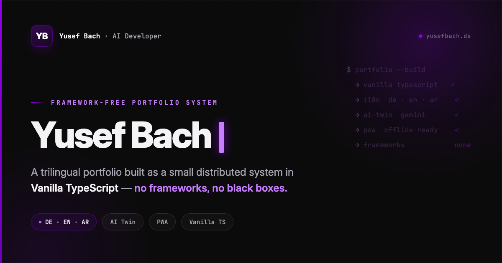

<div align="center">

# Yusef Bach — Portfolio

**A framework-free, fully self-managed portfolio system — built in Vanilla TypeScript.**
Trilingual (DE · EN · AR), statically served, content-managed through a custom admin panel.

<!-- Recommended: 1200×630 px, save as website/images/ui/preview.png -->


[](https://yusefbach.de)
[](#-tech-stack)
[](#-architecture)
[](#-internationalization)
[](#-highlights)
[](#-license)

[**Live Site**](https://yusefbach.de) · [**Changelog**](https://yusefbach.de/changelog.html) · [**Roadmap**](https://yusefbach.de/roadmap.html) · [**Thoughts**](https://yusefbach.de/thoughts/)

</div>

---

## Overview

This is the source of my personal portfolio, [**yusefbach.de**](https://yusefbach.de).

It started as a static page and grew into a **small distributed system**: a public website that stays
100% static and framework-free, an admin panel I use to manage all content without touching code, and an
AI twin that answers visitors' questions. The whole thing is **trilingual** (German, English, Arabic — with
full right-to-left support) and built on a single, deliberate principle:

> **Understand the foundation, then build it — no black boxes.**
> No React, no Vue, no Bootstrap, no Tailwind on the public site. Just Vanilla TypeScript, HTML5 and CSS3.

The point isn't nostalgia for plain JavaScript. It's a statement: that a modern, multilingual, accessible,
content-managed product can be engineered cleanly **without** reaching for a framework — and that I understand
every layer of it, because I wrote every layer of it.

---

## ✨ Highlights

- **🤖 AI Twin ("Ask Yusef · Neural Console")** — a fully redesigned chat widget (breathing AI-ring FAB,
  auto-hide on scroll, mobile bottom-sheet, ⌘K, context-aware prompts) backed by a Python/FastAPI
  microservice and the Gemini API with a 4-model failover chain. Answers in the visitor's language
  (DE/EN/AR) with strict guardrails.
- **🌍 Three languages, fully — statically** — 600+ translation keys, every page translated, Arabic with
  proper RTL layout, and each language **statically pre-rendered** (`/en/`, `/ar/`) with `hreflang` so
  Google indexes every language on its own, not just German.
- **🔒 Security-hardened admin** — four independent layers protect the content backend before it manages
  the live site: access whitelist, PIN as a second factor, rate limiting, and security headers.
- **🎨 "Calm Cinema" design system** — design tokens, Dark/Light mode (no-flash), self-hosted variable fonts
  (Inter + JetBrains Mono), fluid typography, and a homepage built as one continuous canvas with a
  mouse-following aurora and cinematic scroll reveals instead of hard section seams.
- **📝 Managed content sections** — a multilingual blog (`/thoughts`), a public `/changelog` with clickable
  detail cards, a dynamic `/roadmap`, and a live GitHub activity widget — all editable through the admin
  panel, never by hand.
- **♿ Accessibility & performance** — skip links, visible focus states, semantic landmarks, zero CLS,
  lazy-loaded media, and an installable, offline-capable PWA.
- **🔍 SEO-first** — static pre-rendering per language, JSON-LD structured data, generated sitemap with
  `hreflang` alternates.

---

## 🏗 Architecture

The portfolio is not a single project — it is three cooperating components:

```
┌─────────────────────────────┐        ┌────────────────────────────┐
│  Public Portfolio           │        │  Admin Panel               │
│  yusefbach.de               │◀──────▶│  admin.yusefbach.de        │
│  GitHub Pages (static)      │ build/ │  Next.js + Supabase        │
│  Vanilla TS · HTML · CSS    │ commit │  (content management)      │
└──────────────┬──────────────┘        └────────────────────────────┘
               │ calls
               ▼
┌─────────────────────────────┐
│  AI Bot Backend             │
│  Vercel Serverless          │
│  FastAPI + Gemini API       │
└─────────────────────────────┘
```

**Key principle — the public site stays static.** Content is baked into the repository through a build/commit
step; there are **no live database calls from the browser** (aside from a lightweight maintenance-mode poll).
If the backend is down, the site stays up. Structured content flows from the admin panel into Supabase and is
published into the repo via GitHub Actions; translations are committed directly (repo-first).

---

## 🌍 Internationalization

| | |
|---|---|
| **Languages** | German · English · Arabic |
| **Coverage** | 600+ keys, every page fully translated |
| **RTL** | Full right-to-left layout for Arabic (`dir="rtl"` + CSS overrides) |
| **Engine** | Custom async i18n — `fetch()` on `lang/{de,en,ar}.json`, stored in `localStorage` |
| **SEO** | Per-language static pre-rendering + `hreflang` for clean indexing |
| **Switcher** | 3-way language pill (DE · EN · ع) in every header |

The AI bot is trilingual as well — including a right-to-left chat window for Arabic.

---

## 🛠 Tech Stack

Deliberately **zero frontend dependencies** for maximum performance and control.

| Layer | Technology |
|---|---|
| **Frontend** | Vanilla TypeScript (`src/ts/` → `website/js/`), HTML5, CSS3 (Grid, Flexbox, design tokens) |
| **Styling** | Custom token system, Dark/Light themes, self-hosted Inter + JetBrains Mono, fluid `clamp()` scale |
| **Web Components** | `<app-header>`, `<app-footer>`, `<app-project-header>` |
| **i18n** | Custom async JSON engine (DE/EN/AR) + RTL |
| **AI Backend** | Python · FastAPI · Google Gemini (4-model failover) on Vercel Serverless |
| **Content Backend** | Next.js admin panel + Supabase (PostgreSQL, Auth, Storage) — *separate repo* |
| **Build** | TypeScript compiler + Node build scripts + GitHub Actions |
| **Hosting** | GitHub Pages + custom domain · PWA (Service Worker, offline-ready) |
| **Contact** | EmailJS (serverless) |

---

## 📂 Project Structure

```
/
├── website/             ← Web root (published by GitHub Pages)
│   ├── index.html
│   ├── projects/        Case-study pages
│   ├── thoughts/        Generated multilingual blog
│   ├── css/             Design tokens, components, page styles
│   ├── js/              Build output (compiled from src/ts — do not edit directly)
│   ├── lang/            i18n sources (de.json · en.json · ar.json)
│   ├── fonts/           Self-hosted variable fonts
│   ├── images/          Assets (techstack · projects · ui) + WebP variants
│   └── sw.js            Service Worker (PWA)
├── src/ts/              TypeScript source (compiled to website/js)
├── scripts/             Build & pre-render scripts (projects, roadmap, thoughts, sitemap, …)
├── api/                 Vercel serverless function (Python / FastAPI) + AI knowledge base
├── .github/workflows/   CI: build & deploy + content publish pipelines
└── package.json
```

> **Source of truth:** never edit `website/js/` directly — edit `src/ts/` and recompile.

---

## 🚀 Local Development

```bash
# Prerequisites: Node.js 20+

git clone https://github.com/yusef03/PortfolioBach.git
cd PortfolioBach
npm install

# Build: compile TypeScript, pre-render content, generate the service worker
npm run build

# Full pipeline (projects, roadmap, thoughts, sitemap, GitHub activity)
npm run build:all

# Serve website/ with any static server (e.g. VS Code "Live Server")
```

| Script | Purpose |
|---|---|
| `npm run build` | Compile TS → pre-render projects → build service worker |
| `npm run build:all` | Full content pipeline (all generators + pre-render + sitemap) |
| `npm run check-i18n` | Guard: fail on missing / hardcoded translation keys |
| `npm run check-maintenance` | Guard: ensure every page is maintenance-mode aware |

---

## 🧩 The Managed System

Most content on the site is editable through a custom **admin panel** (`admin.yusefbach.de`) — an
Apple-inspired "SPACE" design system built with Next.js + Supabase, with a ⌘K command palette for
keyboard-first navigation — so I can manage everything without touching code:

- **Translations** — edit DE/EN/AR, committed directly to the repo (repo-first)
- **Projects** — cards, badges, status, hero selection
- **Roadmap & Changelog** — versioned, multilingual, with draft/published states
- **Thoughts** — a multilingual blog composer with a live preview (one post in EN/DE/AR)
- **Media** — images, CV, documents
- **Bot Memory** — the AI twin's knowledge base, edited and committed straight to the repo
- **Maintenance Mode** — global on/off, with a safe fallback page
- **System Health** — 7 live checks across every connected service, plus a full activity log

Changes are written to Supabase, then published into this repository via GitHub Actions, which rebuild and
deploy the static site automatically.

### Security

Because this panel will manage the real live site, it's hardened with **four independent layers** — an
attacker who breaks one still fails at the next three:

1. Supabase signups are disabled — an unknown GitHub account never gets a session.
2. A server-side **whitelist** checks email, GitHub username, and auth provider on every request.
3. A **PIN as a second factor** after GitHub login (HMAC-signed, time-limited cookie, rate-limited).
4. **Rate limits + security headers** (HSTS, CSP, X-Frame-Options) on every write path.

The repo the admin writes to is resolved through a single, fail-fast configuration point — switching
targets (e.g. for this exact migration) is one environment variable, never a code change.

---

## 🤝 How It Was Built

This portfolio was built with substantial use of **AI-assisted development**, and I think that's worth
stating openly rather than hiding.

I owned the parts that define the product: the **architecture**, the technical and design decisions, the
quality bar, and the direction of every feature. AI tooling acted as an accelerator for the implementation —
turning decisions into code faster, so I could spend my time on *what* to build and *why*, and on reviewing
and shaping the result until it met the standard I wanted.

I see this as the modern engineering workflow, not a shortcut around it. As an AI Developer, building my own
work this way is a deliberate reflection of how I work every day: human judgement and system design in front,
AI as a force multiplier behind it.

---

## 🗺 Roadmap & Changelog

This project ships with its own public, versioned history:

- 📌 [**Roadmap**](https://yusefbach.de/roadmap.html) — what's planned and in progress
- 📜 [**Changelog**](https://yusefbach.de/changelog.html) — every release, categorized and dated

---

## 📄 License

**© 2026 Yusef Bach — All Rights Reserved.**

The source is public for transparency and as a showcase of my work. It is **not** licensed for reuse,
redistribution, or cloning of the portfolio, its design, or its content. Feel free to read the code and learn
from it — but please build your own thing.

---

## 📬 Contact

- 📧 [kontakt@yusefbach.de](mailto:kontakt@yusefbach.de)
- 🌐 [yusefbach.de](https://yusefbach.de)
- 💼 [LinkedIn](https://www.linkedin.com/in/yusef-bach/)
- 🐙 [GitHub](https://github.com/yusef03)

<div align="center">

---

*Built with intent, not dependencies.*

</div>
